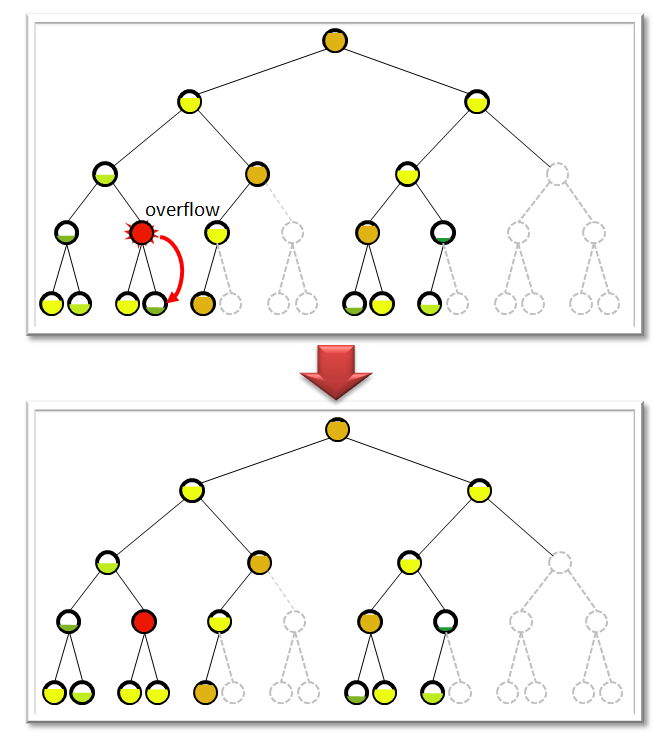
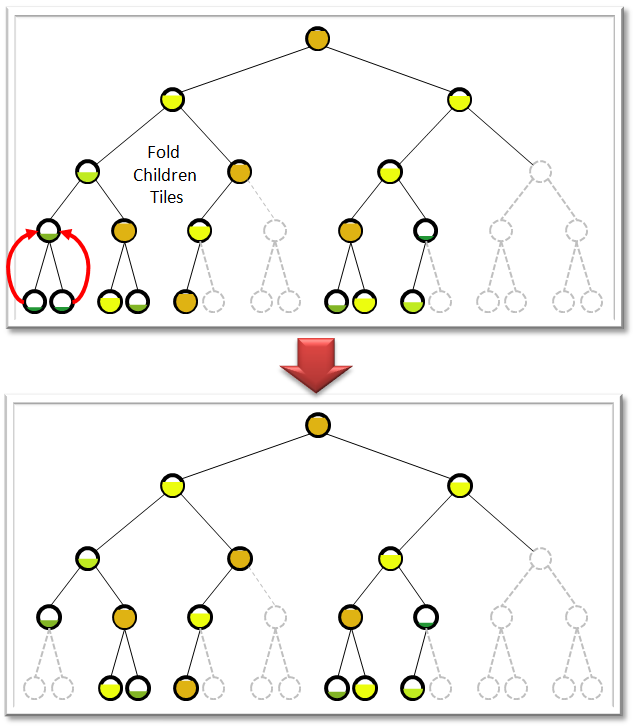

* *T3DModels*

A 3DModel is a geospecific modeled geometric representation of 3D point, lineal and areal features. The modeled geometry representation can reference both geotypical and geospecific modeled textures. 3DModels are the modeled representation of man-made features such as buildings, bridges, towers, or natural features such as trees and forested areas.

The T3DModels are stored in the OpenFlight format. The CDB conventions described herein are designed to facilitate the integration of such models onto the terrain tile, hence the name “**T**iled *3D* *Models*”. Each 3DModel can have one or more modeled representation (called a 3DModel-LOD) that represents the feature to a certain level of fidelity. 3DModel-LODs are re-grouped into T3DModel Tile-LODs; this re-grouping approach is designed to reduce the overheads associated with the access of 3DModel-LODs. Furthermore, T3DModel-LODs can be accessed without a prior reference to a matching feature.

The integration of T3DModels to the underlying terrain skin is performed by the client-devices at runtime. Historically, this integration has always been performed by the tools and was “baked-in” into the SE terrain skin during the offline database generation process. Many client-specific considerations went into the mechanisms required to support this integration and as a result, the resulting synthetic environments were very client-specific and did not scale easily to higher resolutions.

In line with CDB principles, the T3DModel Dataset defers this integration and imposes it on the consumers (not the producers) of synthetic environments. As a result, client-devices can independently access, manage and control each dataset, i.e. the Primary Elevation, the VSTI Imagery, the T3DModel, etc. This layered approach to synthetic environment production and consumption provides a much greater level of abstraction between the SE data model and the data models internal to each client-device. It is understood, that the deferral of the integration process imposes added functionality and computational requirements on the part of the CDB client-devices.

While it would be possible, in theory, to use the T3DModel Dataset for the modeling of the terrain skin, this use-case is specifically forbidden because the T3DModel Dataset does not provide a guarantee of full tile coverage. As a result, the Primary Elevation Dataset is always required regardless of whether a corresponding Tile-LOD of the T2DModel is present or not. Furthermore, since CDB forbids the duplication of information, the terrain skin cannot be duplicated by the T3DModel Dataset.

Client-devices must always access the Primary Elevation prior to (e.g. with a higher priority than) any other raster dataset. Once a Tile-LOD of the Primary Elevation is loaded, a client-device can then access the T2DModel Dataset at an “appropriate” LOD footnote:[In this context, “appropriate” signifies a LOD that falls within the performance capabilities of the client-device via its scene-load management sub-system or is alternately overridden explicitly and by its user.]. Following this, the client-device must integrate the models found within the T3DModel Tile-LOD with the terrain found in the Primary Elevation Dataset.

Each 3DModel is attributed with a unique identifier based on the associated features Feature Attribute Code (FACC), Feature Sub-Code (FSC) and Model Name (MODL). The CDB’s Feature Data Dictionary (FDD) listed in Appendix N provides all the features that can be used in the T2DModels.

The 3D geometric representation of 3D terrain surface features is based on the OpenFlight Scene Description Database Specification (per Appendix C).

The T3DModel geometry resides in the T3DModelGeometry dataset branch directory. The textures referenced by the T3DModelGeometry files reside in the T3DModelTexture dataset branch directory. The material textures referenced by the T3DModelGeometry files reside in the T3DModelMaterial dataset branch directory. Finally, the texture composite material table referenced by the material textures resides in the T3DModelTextureCMT dataset branch directory.

* *T3DModel Levels-of-Detail*

3D features can have modeled representations at varying levels of detail. Each of these modeled-representations is referred to as a 3DModel-LOD. A 3DModel-LOD consists of a group of polygons that represent a 3D feature at a specific level-of-detail.

Once a 3DModel-LOD is inserted into the T3DModel Dataset hierarchy, it is then referred to as a T3DModel-LOD. 3DModel-LODs are regrouped into files called T3DModel Tile-LODs. The T3DModel Tile-LODs are assembled into a hierarchy of Tile-LODs called the T3DModel Dataset.

The insertion of a 3DModel-LOD into the LOD hierarchy of the T3DModel Dataset is solely dependent on its Location, its Significant Size and on its Storage Size.

The organization of the modeled content into files that contain co-located objects of similar size greatly improves runtime performance. The location and Significant Size of a 3DModel-LOD determines where it is nominally inserted into the T3DModel LOD hierarchy. This approach ensures that the modeled content is organized in files that contain co-located objects of similarly size. _This approach provides client-device with an optimal means of accessing and filtering modeled content (by location and by size)._

3DModel-LODs are accumulated into Tiles for each LOD of the T3DModel hierarchy. The size of these T3DModel Tiles is capped to _T3DModelFileSize_. In the event that the insertion of a 3DModel-LOD causes this limit to be exceeded, the 3DModel-LODs that are deemed to have the lowest contribution to the Tile are moved to finer Tiles of the T3DModel hierarchy until the Tile is once again within its size limit. In the event that the 3DModel-LOD is larger than _T3DModelFileSize_, the 3DModel-LOD can be moved to the 4 finer Tiles of the T3DModel hierarchy (illustrated in Figure A‑29: Handling Tile-LOD Overflows within the T3DModels Dataset Hierarchy). _This approach ensures that the modeled content is accessible in chunks that are bounded; this is critical to the effective allocation and management of memory in the client-devices as well as improving client-device performance and determinism._

Note: The CDB Specification defines the value of _T3DModelFileSize_ to 16 MB

NOTE: The Significant Size of a 3DModel-LOD determines where it is nominally inserted into the T3DModel LOD hierarchy. In this nominal case, each Tile-LOD of the T3DModel Dataset holds a group of 3DModels-LODs that have similar Significant Sizes. This enables the client-devices to determine the range at which the T3Model-LOD can be optimally blended-in to the scene (so that the model falls within a specified angular error criterion).

The bounding criterion of T3DModel Tiles can lead to LOD migration, thus breaking the relationship between the Significant Size of a 3DModel-LOD and the nominal CDB LOD it belongs to. As a result, client-devices can no longer guarantee the range at which the 3DModel-LOD will be blended-in to the scene. In effect, each time the 3DModel-LOD is migrated by one LOD, the client-device will likely shorten the range at which it is blended into the scene by a factor of 2X, leading to potentially distracting artifacts. The severity of the artifacts is proportional to the amount of content that has migrated to finer LODs and to the number of LODs by which the content has moved.

While this addendum allows the migration of 3DModel-LODs to finer LODs when Tile-LODs overflows are encountered, it is understood that this may lead to rendering artifacts that might be considered unsatisfactory. _Consequently, it is strongly recommended that tools (that generate the CDB hierarchy) be designed to optionally disallow the migration of T3DModel-LODs to finer LODs upon overflows, and instead flag the overflow condition and then abort._ Upon such cases, modelers can then re-assess which T3DModels should be discarded or remodeled in order to simultaneously satisfy the CDB bounding criteria and the application requirements.

Each of the Tile-LODs of the T3DModel Dataset are nominally configured as exchange-LODs (aka substitution-LODs). The exchange-LOD mechanism assumes that client-devices gradually substitute a coarser Tile-LOD with a four finer Tile-LODs.

While this exchange-LOD mechanism is simple, it can lead to inefficiencies when extremely fine features cause the T3DModel Dataset hierarchy to be extended by several LODs. Consider the case of 13m road lineals overlaid with 6 cm stripe lineals. As we will see in the following section, insertion of the *Stripe* lineal would nominally occur at LOD=7 of the T3DModel hierarchy while the *Road* lineal would occur at LOD=-1. The Stripe lineals force the T3DModel Dataset hierarchy to be extended (and clipped) to 8 additional LODs. In effect, the Road lineals are repeated footnote:[Since the nominal LOD mechanism is the exchange-LOD, and that gaps are not permitted in the LOD hierarchy] in LODs 0 through 7 leading to important storage inefficiencies and greater computational burden by the client-devices.

*Figure A‑29: Handling Tile-LOD Overflows within the T3DModels Dataset Hierarchy*

In order to resolve this use-case, the T3DModel Dataset is post-processed and subjected to a “compaction” process, starting from the finest LOD (e.g. _LOD~max~_) and progressing to the coarser levels. The compaction process takes the content of the Tile-LODs located at _LOD~max~_ and packs them as an additive LODs of the parent Tile-LOD at (_LOD~max~_ – 1) of the parent Tile-LOD. The process is recursively applied to the coarser LODs until the parent LOD is packed to capacity. _This approach ensures that the modeled content is accessible in similarly-sized chunks of processing; this provides the means to improve internal parallelism and pipelining (ie. improves client-device determinism)._ The result is a LOD hierarchy which is less deep, and with content which is more uniformly distributed; both of these characteristics improve runtime performance and determinism.

The T3DModel LOD structure is continuous i.e. there is no gap in the LOD hierarchy. This means that once a 3DModel-LOD is inserted into a finer level of the T3DModel hierarchy, the same 2DModel-LOD is propagated to coarser LODs until a coarser 3DModel-LOD is available.

